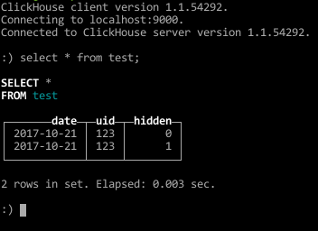

# ch-encode
Clickhouse typesafe RowBinary insert data encoder generator for Go. Supported types:

String | FixedString(N) | UIntX | IntX | EnumX | Array(T)|FloatX
-------|----------------|-------|------|-------|---------|------

Arrays of arrays are not tested though

## The problem
* Tables can be wide and thus generating proper INSERT statements is a source of errors itself.
* Proper data buffering on INSERT statements is a bit tricky

## Solution
* Take Clickhouse table. Map it into the function call (column → function parameter)
* Function generates binary data in Clickhouse RowBinary format. Buffering became trivial (special bufferer is needed anyway - 
function call output which represents a table record must not be splitted)

## Problems raised
* Scheme desync - this can be detected with autogenerated tests, where the state of table scheme will be stored and then compared to current scheme

## Bonuses
* Testing mock objects can be generated as well.
* It is fast as it avoids any allocation in a process and RawBinary is a the easiest format after Native for the Clickhouse and practically the fastest method of insertion via standalone tools.


# How to use
```bash
go get github.com/glossina/ch-encode
```
then
```bash
ch-encode table1 table2 … tableN
```
will generated N packages in the current folder with autogenerated encoders and desync tests

Example.

1. Let's create clickhouse table
    ```sql
    CREATE TABLE test
    (
        date Date, 
        uid String, 
        hidden UInt8
    ) ENGINE = MergeTree(date, (date, uid, hidden), 8192);
    ```
2. Let we have translation dictionary translation.yaml
    ```yaml
    uid: UID
    ```
    we use translation in order uid to be translated into UID in generated code
3. Now generate encoder
    ```bash
    bin/ch-encode --yaml-dict=translation.yaml test
    ```
    test directory will appear in current directory, it will have two go files, test.go and test_test.go.
    this is **test** package. Move it into src to be seen by **go install**
 4. Now, some code
    ```go
    package main
     
    import (
     	"bytes"
     	"errors"
     	"io/ioutil"
     	"net/http"
     	"test"
     	"time"
    )
     
    // inserter will implement io.Writer
    type inserter struct{}
     
    // Write implementation for inserter, it will just insert everything it got into clickhouse table `test` as RowBinary data
    func (i inserter) Write(p []byte) (n int, err error) {
     	client := &http.Client{}
     	request, err := http.NewRequest("POST", "http://localhost:8123", bytes.NewBuffer(p))
     	if err != nil {
     		return -1, err
     	}
     	q := request.URL.Query()
     	q.Set("query", "INSERT INTO test FORMAT RowBinary")
     	request.URL.RawQuery = q.Encode()
     
     	resp, err := client.Do(request)
     	if err != nil {
     		return -1, err
     	}
     	defer resp.Body.Close()
     	data, err := ioutil.ReadAll(resp.Body)
     	if err != nil {
     		return -1, err
     	}
     	if resp.StatusCode != http.StatusOK {
     		return -1, errors.New(string(data))
     	}
     	return len(p), nil
    }
     
    func main() {
     	e := test.NewTestRawEncoder(inserter{})
     	date := time.Date(2006, 1, 2, 3, 4, 5, 0, time.UTC)
     	err := e.Encode(
     		test.Date.FromTime(date),
     		test.UID("123123"),
     		test.Hidden(1))
     	if err != nil {
     		panic(err)
     	}
     	err = e.Encode(
     		test.Date.FromTime(date),
     		test.UID("321321"),
     		test.Hidden(0))
     	if err != nil {
     		panic(err)
     	}
    }
    ```
5. See test table now

    
    
# Details
Let's see into the generated test.go file.

There's test encoder
```go
type TestEncoder interface {
	Encode(date DateType, uid UID, hidden Hidden) error
	InsertCount() int
	ErrorCount() int
}
```

And there are 4 types that implements TestEncoder:
```go
type TestRawEncoder {}           // Regular RowBinary data generator
type TestRawEncoderDateFilter{}  // Will only generate data for a given date
type TestRawEncoderVoid{}        // Will not generate anything
type TestingTestEncoder{}        // For testing purposes
```

We saw how the TestRawEncoder works. Bother TestRawEncoderDateFilter and TestRawEncoderVoid work the same way. Let's see how to use TestingTestEncoder:
```go
package main

import (
	"encoding/json"
	"fmt"
	"test"
	"time"
)

func main() {
	e := test.NewTestingTestEncoder()
	date := time.Date(2006, 1, 2, 3, 4, 5, 0, time.UTC)
	err := e.Encode(
		test.Date.FromTime(date),
		test.UID("123123"),
		test.Hidden(1))
	if err != nil {
		panic(err)
	}
	err = e.Encode(
		test.Date.FromTime(date),
		test.UID("321321"),
		test.Hidden(0))
	if err != nil {
		panic(err)
	}
	data, _ := json.MarshalIndent(e.Result, "", "    ")
	fmt.Println(string(data))
}
```
this program will output
```json
[
    {
        "Date": "2006-01-02",
        "UID": "123123",
        "Hidden": 1
    },
    {
        "Date": "2006-01-02",
        "UID": "321321",
        "Hidden": 0
    }
]
```
Good for testing, you see. 
DateTime type will be represented as %Y-%m-%dT%H:%M:%S string, enums will be represented as their text values. Other clickhouse types match directly into Golang equivalents (Int16 -> int16, Float64 -> float64, UInt32 -> uint32, etc)
